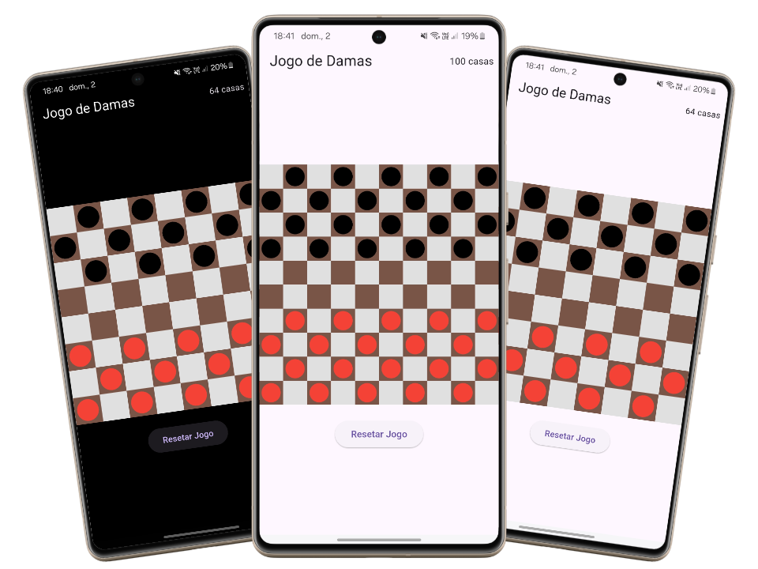

# Jogo de Damas em Flutter

Este é um projeto de um jogo de damas implementado em Flutter. O jogo segue as regras tradicionais das damas, permitindo movimentos simples e de captura, além da promoção de peças a dama quando alcançam a última linha adversária.

<p align="center">
  
</p>

## Funcionalidades

- **Tabuleiro:** O jogo utiliza um tabuleiro de 8x8 ou 10x10 casas, com alternância de cores para representar as casas escuras e claras.
- **Movimentos e Capturas:** Implementação das regras para movimentos simples e capturas obrigatórias, considerando as diferenças entre peças normais e damas.
- **Promoção de Peças:** Peças normais são promovidas a damas ao atingirem a última linha do tabuleiro do oponente.
- **Interface Interativa:** Permite que o jogador selecione peças e realize movimentos através de toques na tela.
- **Inteligência Artificial (IA):** O adversário (peças pretas) é controlado por uma IA simples que escolhe movimentos válidos aleatoriamente, priorizando capturas quando disponíveis.
- **Destaque de Seleção:** A peça selecionada pelo jogador é destacada visualmente (com uma cor diferenciada).

## Tecnologias Utilizadas

- **ChatGPT o3-mini-high** Modelo de raciocínio, ótimo em programação e lógica.
- **Flutter:** Framework para desenvolvimento de aplicações móveis.
- **Dart:** Linguagem de programação utilizada para desenvolver o aplicativo.

## Como Executar o Projeto

### Pré-requisitos

- [Flutter SDK](https://flutter.dev/docs/get-started/install) instalado em sua máquina.
- Um dispositivo ou emulador configurado para rodar aplicativos Flutter.

### Passos para execução

1. **Clone o repositório:**

   ```bash
   git clone https://github.com/carlosxfelipe/damas-app
   ```
